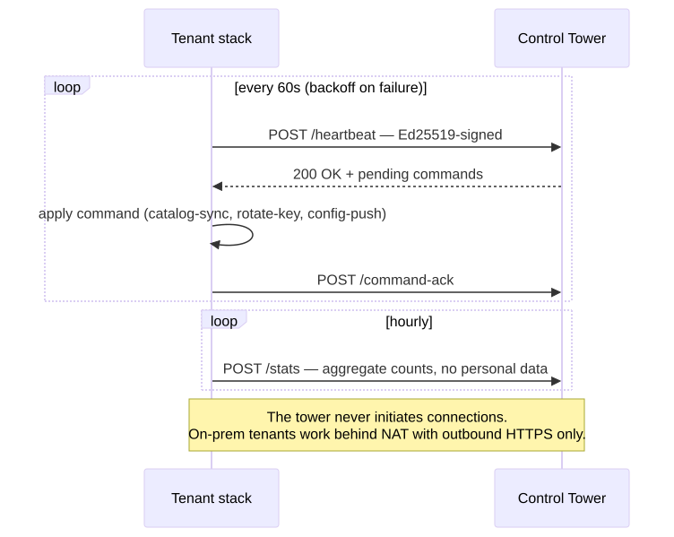

# Introduction

Every healthcare B2B sale I've been in reaches the same moment. The demo goes fine, the doctors like it, and then the hospital IT director leans back and asks:

> "So where exactly does our patient data live?"

Whatever you answer in the next thirty seconds decides the deal faster than any feature you showed them.

This post is about the tenancy design I ended up with for our rehab platform: a **silo model**, where every hospital customer gets its own full stack (own database, own cache, own storage, own network), all running the **same codebase**, with a central control plane watching over all of them. I'll walk through why I picked it, what it costs, and how to reason about the choice for your own SaaS, because the right answer for you is probably different.

:::note
This is an engineering perspective from building one product. I'm not claiming silo is universally correct. It isn't. There's a whole section at the end about when you should not do this.
:::

# What "multi-tenancy" actually means in practice

People throw the word around like it's one thing. It's a spectrum, and where you sit on it decides most of your operational life. The three shapes:

**Pooled.** One database, one app, every row has a `tenant_id` column. Cheapest to run. Also: every query you ever write carries `WHERE tenant_id = ?` forever, and the one time somebody forgets it, you've leaked one hospital's patients into another hospital's screen. One bad migration takes down every customer simultaneously, in the same minute, on the same outage page. Restoring a single customer's data means surgically extracting it from a live shared database, which nobody enjoys at 2am.

**Bridge.** Shared cluster, database (or schema) per tenant. Middle ground. Isolation at the data layer, shared everything else. Better blast radius, still shared compute and shared meltdowns.

**Silo.** Every tenant gets the whole stack: their own database, their own cache, their own object storage, their own containers. Most expensive per tenant. Also the only model where "this hospital's data" has a physical answer you can point at.

I ended up at silo. Getting there wasn't a preference, it was arithmetic on a few questions.

# How to pick a model for your SaaS

These are the questions I actually asked. In rough order of how much they mattered.

**1. What does your worst day look like?**

Write down the sentence "we leaked hospital A's patient records to hospital B" and imagine sending it to your customers. In healthcare that sentence ends the company. Not hurts it, ends it. PDPA liability, hospital contracts, reputation, done. If your worst day is "some users saw a slower dashboard", pooled is fine and you should save the money.

**2. Who decides to buy?**

Consumer SaaS: users decide, in seconds, and churn in seconds. B2B healthcare: an IT director and a director of medicine decide, over months, and the deployment review is part of the product. When the buyer is the person asking "where does our data live", isolation is a sales feature, not overhead.

**3. Will you ever need to run on the customer's infrastructure?**

We knew the answer was eventually yes. Some hospitals want (or procurement requires) the system running inside their own network, on their own metal. That requirement forces single-tenant-shaped deployment whether you like it or not, so your architecture has to be a single-tenant unit you can stamp out N times anyway. Once that's true, "cloud" and "on-prem" become the same artifact deployed in different places, which is exactly what we wanted.

**4. Can your team operate N stacks?**

This is the real cost gate. If the answer is no and you can't automate your way to yes, silo will eat you. More on that in the costs section.

# Why silo won for us

The product is a rehab exercise platform: doctors prescribe exercise programs, patients do them through a LINE mini app with on-device pose detection, doctors watch progress. B2B, hospitals and clinics, Thailand.

Four things pushed me to silo:

- **We're B2B and every customer runs the same codebase.** No hospital needs a custom fork. So the unit of deployment could be "the whole product, once per customer" with zero product divergence.
- **Healthcare people are correctly paranoid.** Thai hospitals care about PDPA, about data residency, about who can see what. The sentence "your data lives in your own Postgres, on a machine you can point at, and no other hospital's data has ever been in it" does more for a deal than any roadmap slide. Call it easing geezer minds if you want; the geezers sign the contracts.
- **Blast radius.** One tenant's runaway job, one botched migration, one noisy neighbor: it's that tenant's problem, at that tenant's pace. Everyone else doesn't know it happened.
- **On-prem had to exist eventually**, and as question 3 above says, that forces the shape anyway.

There was also a quieter reason: operational sanity. Per-tenant backup and restore is a whole-stack snapshot, not surgery. Per-tenant upgrade is a rolling decision per customer. If a hospital wants to stay on an older version for a month while their IT reviews, that's their stack, their choice, no feature flags required.

# The architecture

The shape in one paragraph: **one codebase, one container image, stamped out once per tenant, plus a central control plane** ("the tower") that provisions and monitors all of them.

Each tenant stack is a compose deployment with its own Postgres, Redis, object storage, the API, the doctor dashboard, and the patient mini app, all inside a Docker network named after the tenant. Nothing inside that network needs to talk to another tenant, ever. The tenant gets its own domain pair (API and app), its own TLS, its own everything.

## The detail that makes on-prem work: tenants call home, the tower never dials in

This is the single most important rule in the whole design, so it gets its own heading.

**The control plane never initiates connections to tenants.** Every communication is tenant-initiated:

- Each tenant sends a **heartbeat** every 60 seconds (with exponential backoff if the tower is unreachable). The heartbeat carries health status and metrics.
- The tower's response to a heartbeat is where **commands ride back**: "push the latest exercise catalog", "rotate your key", "force a heartbeat now". Commands piggyback on a connection the tenant already opened.
- Tenants push **aggregate stats** hourly: counts only, no personal data ever leaves the tenant.

Why this matters: a tenant deployed inside a hospital network is behind NAT, behind firewalls, in rooms you will never see. If your control plane needs to reach in, on-prem is dead on arrival. If tenants call out, the same artifact works in your cloud, in the customer's datacenter, and in a hospital basement with one outbound rule. HTTP(S) outbound only. That's the whole network requirement.

:::tip
If you take one architectural idea from this post, take this one. Pull-based control beats push-based control the moment customers host things themselves. Your monitoring, your config distribution, and your remote commands should all ride connections the tenant opens.
:::

## The command mailbox

The obvious question about a control plane that can't reach its tenants: how do you control them? You use the channel that's already open, sixty times an hour.

A command is a row in a per-tenant queue, nothing more. When a heartbeat arrives, the tower attaches any due commands to the response. The tenant executes them, and the next heartbeat carries the result back as an ack. That's the whole protocol. "Push the latest exercise catalog", "rotate your signing key", "force a heartbeat now": all of it is mail in a mailbox, picked up on a schedule the tenant controls.

Three details keep it honest:

- **Every command has a TTL.** If it isn't acked within a few beats it expires and surfaces as failed. A command aimed at a tenant that went down shouldn't sit in the queue forever, and the operator should see that it never landed.
- **Handlers are idempotent.** Delivery is at-least-once on a good day: the tenant can execute a command and then lose the connection before the ack goes out, so the same command can arrive twice. Commands are therefore written against desired state ("you should be on catalog version 12"), never against counts of actions ("apply 12 updates").
- **Acks carry structured results.** What version was applied, what failed, how long it took. The tower's UI shows command history per tenant with timestamps, without anyone grepping logs on a box they can't reach.

That history is a side effect of the design, and in healthcare it's half the value. Auditors like knowing who told which tenant to do what, when, and whether it worked.

## Trust, but signed

Since tenants are the ones talking to the tower, the tower needs to know a tenant is who it claims. Every tenant request is **Ed25519-signed**: headers carry the tenant code, a signature over a canonical request string, a timestamp, and a single-use nonce. The tower rejects stale timestamps and replays. Revoking a tenant's key is how you suspend a tenant. There is no shared static API key sitting in every environment, which was the first thing I wanted gone.

## One image, any tenant

We build **one set of container images**, versioned by tag. The same image runs for every tenant; anything tenant-specific is runtime configuration injected at deploy time (domains, LINE app ids, feature knobs). A per-tenant image would have been a maintenance nightmare, so there isn't one.

## Migrations run N times, so they only go forward

Every tenant stack boots the same way: a small migration sidecar runs the database migrations first, then the API starts. With N tenants on N schedules, "roll back the migration" stops being a real strategy, so it isn't one:

- **Deploys are upgrade-only.** Migrations roll forward, including ones that fix a failed deploy.
- The scary-sounding "rollback" button in the control panel is actually **teardown**: destroying that job's resources, deliberately destructive, gated behind suspending the tenant first. Recovery from a bad deploy means rolling forward to a newer tag, not version time travel.

## Provisioning is automation or it is death

I learned this the hard way: hand-deploying tenant number three sucks, and tenant number ten is a resignation letter. Our control plane drives the hosting API end to end: create the project, create the database, create the cache, create the isolated network, push the compose definition with the right image tag and env, wire up domains. It's a resumable, step-by-step job with a timeline you can watch in the UI, because when it fails (it will, somewhere, someday) you need to see exactly which step and why.

If you can't get to "new tenant in minutes, by clicking", silo's costs stop being worth it. That automation isn't optional polish, it's load-bearing.

## One provisioner, several deployment routes

The tower doesn't hardcode a single way to make a tenant exist. Every provisioning job runs against a small provisioner interface (create the stack, report status, tear it down), and the deployment type is just data on the tenant record. Two routes exist today, and they look nothing alike under the hood.

**Managed.** The tower drives a cluster API end to end: create the project, the database, the cache, the isolated network, push the compose definition with the right image tag, wire up the domains. Then the step that matters more than it looks: before anything boots, the tower injects the callback configuration (tower URL, tenant code, signing key material) as runtime environment. The stack's first act on startup is to call home. Nobody SSHes anywhere, nobody edits files on a box, and the tenant-to-tower connection is wired by the same automation that wired the tenant.

**Manual.** For on-prem, customer metal, or a hosting setup with no API worth the name. The tower still owns the bookkeeping: it issues the tenant code and credentials and holds the record, but the stack is deployed by hands (ours or the customer's) in a network the tower will never see. The stack boots with a bootstrap config, and the first heartbeat doubles as registration: the tenant tells the tower it's alive, which URLs actually work, what versions it's running. The tower learns the topology from the tenant, in the only direction that was ever going to work.

After that first heartbeat the routes converge completely: same monitoring, same command queue, same stats pipeline. The rest of the tower doesn't know or care which route a tenant arrived by, and that's the actual point of the abstraction. Adding a third route (another cluster API, a marketplace install, whatever next year's procurement demands) means implementing an interface, not redesigning the plane.

## What's bad about this control plane

The honest list, because this design has real costs beyond the fleet overhead:

- **Everything is at least one heartbeat late.** A command lands within a minute on a good day, and its confirmation arrives a beat later. For "push the catalog" that's irrelevant. For "something is wrong, act now" it's an eternity, and there is no faster path, by construction.
- **Silence is ambiguous.** If a tenant stops heartbeating, it might be down, partitioned, or just backed off after a network blip. You can't probe it to find out, because you can't probe it at all. First-line diagnosis is comparing timestamps and hoping; real diagnosis means a human at the hospital.
- **You are hand-rolling a message queue.** TTLs, retries, idempotency, acks: that's broker vocabulary, and the bug classes that come with it. The protocol only stays small because commands stay rare and boring. The day someone wants chatty remote control, this design fights them.
- **No interactive debugging.** No SSH, no log tailing, no port-forward into a tenant. You see exactly what the tenant chooses to send. Debugging an on-prem stack means asking the customer to paste command output into an email.
- **The manual route is a second code path with worse visibility.** A tenant somebody deployed by hand can sit on an old image for months (their right, our blindness), and every difference between how the two routes configure a stack is a difference that can bite during an incident.
- **Key rotation is a careful dance.** The signing key authenticates the very channel you'd use to fix the signing key. Rotation has to overlap old and new keys long enough for the tenant to pick the new one up, or you've suspended your own tenant and the recovery is a car ride.

## Why I did it anyway

Because the alternatives lose worse:

- **It works behind anything.** NAT, hospital firewalls, a basement network with one outbound rule. A push-based control plane needs the customer to open holes toward me; polling needs nothing I don't already have.
- **"Your control plane cannot connect to our network" ends the security review.** Inbound-zero is a one-line answer that procurement can verify. Nobody has to trust my promises about firewalls.
- **One protocol for every tenant.** Cloud, on-prem, manual, managed: same heartbeat, same queue, same dashboard. No special tooling for special customers, and that kind of entropy is what kills small teams.
- **The scope is bounded on purpose.** Commands are rare, idempotent, and low-frequency, so the mailbox stays small and boring. Small and boring is exactly what you want in a control channel.
- **Degradation is graceful.** If the tower is down, tenants back off and retry. Nothing cascades, nothing times out loudly, and when the tower comes back the fleet walks in over the next minute or two.

# The costs, honestly

Everything above was the sales pitch. Here's the bill.

**You operate N of everything.** N databases to migrate, N stacks to patch, N sets of logs. Mitigation is the heartbeat-and-stats pipeline plus disciplined structured logging (single-line JSON with an event name, one summary line per request), so "what's happening across the fleet" is a dashboard, not an SSH loop. But the fleet reality doesn't go away.

**Every tenant has a floor cost.** A database, a cache, storage, app containers each. Our per-tenant footprint is modest (this isn't Kubernetes-per-customer), but it's nonzero, and it shapes pricing.

**Cross-tenant queries do not exist.** There is no "average across all patients" query, because there is no place where that data lives together. That's a privacy feature until product asks for a benchmark report, and then it's an engineering project: the answer is tenants pushing aggregates (which we already do for stats), never a shared warehouse of raw rows.

**More moving parts to test.** Signing, replay protection, "the tower never probes tenants", migration idempotency: these are invariants now, and invariants need tests or they slowly rot.

**The control plane is now a product.** Monitoring UI, provisioning jobs, commands, audit trail. That's real time that pooled-SaaS competitors spend on features. You're buying isolation and on-prem capability with your engineering hours; make sure that's the trade you want.

# When you should not pick silo

To be clear about the flip side:

- Consumer or prosumer product, self-serve, price-sensitive: pooled. Silo's floor cost per tenant will eat your margins.
- Your team is one or two people with no infra automation appetite: pooled or bridge until that changes.
- You will realistically never deploy on customer infrastructure and your buyers don't ask about data isolation: you'd be paying for paranoia you can't sell back.
- You need heavy cross-tenant analytics on raw data as a core feature: shared data is your product, and silo fights it.

# Takeaway

Pick the cheapest tenancy model your worst day can survive. Write the leak headline, the outage headline, the "restore one customer" runbook, and read them back to yourself. If your buyers are hospitals, geezers with signing authority who ask where data lives before asking what the product does, the cheapest model that survives those questions is a silo, and the only way to afford it is to automate the stamping.

The design that made it work for us wasn't clever, it was three boring rules: one image for every tenant, tenants call home (never the reverse), and migrations only move forward. Everything else was making those rules convenient to live with.
